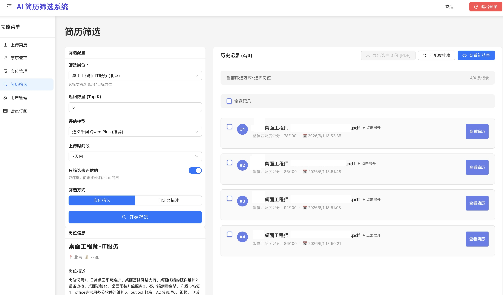

# AI 简历筛选系统

基于阿里通义千问 Embedding、Milvus 向量数据库、Qwen3-Reranker 和多模型 LLM 的 AI 简历筛选系统，采用前后端分离架构，所有 AI 服务使用云端 API。

## 主要截图

## 技术栈

### 后端
- **API 框架**: FastAPI
- **Embedding**: 阿里通义千问 text-embedding-v3（云端）
- **向量数据库**: Milvus
- **Reranker**: 阿里通义千问 qwen3-rerank（云端）
- **LLM**: 阿里通义千问 / DeepSeek / 字节豆包（云端，可切换）
- **任务队列**: Celery + Redis
- **数据库**: PostgreSQL
- **Python**: >=3.12

### 前端
- **Framework**: React 18
- **UI**: Ant Design
- **Build Tool**: Vite
- **HTTP Client**: Axios

## 项目结构

```
hr/
├── backend/                          # 后端目录
│   ├── app/
│   │   ├── main.py                   # FastAPI 应用入口
│   │   ├── config.py                 # 配置（自动查找 .env）
│   │   ├── models/                   # 数据模型
│   │   ├── services/                 # 业务逻辑服务
│   │   │   ├── embedding.py          # 嵌入模型服务
│   │   │   ├── vector_db.py          # 向量数据库服务
│   │   │   ├── reranker.py           # 重排序服务
│   │   │   └── llm.py                # LLM 服务
│   │   ├── routes/                   # API 路由
│   │   └── core/                     # 核心系统
├── frontend/                         # 前端目录
│   └── src/
│       ├── pages/                    # 页面组件
│       │   ├── Screening.jsx         # 简历筛选（核心页面）
│       │   ├── ResumeUpload.jsx      # 简历上传
│       │   ├── JobManagement.jsx     # 岗位管理
│       │   └── ...
│       ├── components/               # 公共组件
│       └── utils/                    # 工具函数
├── alembic/                          # 数据库迁移
├── docker-compose.yml                # Milvus / PostgreSQL / Redis
├── pyproject.toml                    # Python 依赖配置
├── .env.example                      # 环境变量示例
├── start-all.sh                      # 一键启动
└── start-celery.sh                   # 启动 Celery
```

## 快速开始

### 1. 克隆项目
```bash
git clone https://github.com/matrix273/hr.git
cd hr
```

### 2. 安装后端依赖
```bash
uv sync
```

### 3. 启动基础设施（Docker）
```bash
docker compose up -d
```
这会启动：Milvus（向量库）、PostgreSQL（数据库）、Redis（任务队列）。

### 4. 配置环境变量
```bash
cp .env.example .env
```
编辑 `.env`，填入以下云服务 API Key：
- `QWEN_EMBEDDING_API_KEY` — 阿里通义千问
- `QWEN_RERANKER_API_KEY` — 阿里通义千问
- `LLM_API_KEY` — 阿里通义千问（默认）/ DeepSeek / 字节豆包

#### 获取 API Key

| 服务 | 获取地址 |
|------|---------|
| 阿里通义千问 | https://dashscope.console.aliyun.com/apiKey |

#### 配置加载顺序

应用启动时，`backend/app/config.py` 会按以下顺序查找 `.env` 文件：

1. `backend/.env`（如果存在，优先使用）
2. 根目录 `.env`（默认位置）
3. 使用默认值

### 5. 初始化数据库
```bash
alembic upgrade head
```

### 6. 启动后端
```bash
./start-backend.sh
# 或
uv run uvicorn app.main:app --host 0.0.0.0 --port 8000 --reload
```

### 7. 启动 Celery（简历上传解析）
```bash
./start-celery.sh
```

### 8. 启动前端
```bash
cd frontend && npm install && npm run dev
# 或
./start-frontend.sh
```

### 一键启动
```bash
./start-all.sh
```

### 验证服务
```bash
# 检查 Milvus
curl http://localhost:19530/healthz

# 检查 FastAPI
curl http://localhost:8000/api/health

# 打开浏览器访问 API 文档
open http://localhost:8000/docs

# 打开前端应用
open http://localhost:5173
```

## 环境变量配置

关键配置项（详见 `.env.example`）：

### AI 服务（全部使用云端 API）
```env
# Embedding - 阿里通义千问
QWEN_EMBEDDING_URL=https://dashscope.aliyuncs.com/compatible-mode/v1/embeddings
QWEN_EMBEDDING_API_KEY=your_key
QWEN_EMBEDDING_MODEL=text-embedding-v3

# Reranker - 阿里通义千问
QWEN_RERANKER_URL=https://dashscope.aliyuncs.com/compatible-api/v1/reranks
QWEN_RERANKER_API_KEY=your_key
QWEN_RERANKER_MODEL=qwen3-rerank

# LLM - 阿里通义千问（默认）
LLM_URL=https://dashscope.aliyuncs.com/compatible-mode/v1/chat/completions
LLM_API_KEY=your_key
LLM_MODEL=qwen-plus
```

### 基础设施
```env
# PostgreSQL
POSTGRES_HOST=localhost
POSTGRES_PORT=5432
POSTGRES_USER=pgadmin
POSTGRES_PASSWORD=pgadmin
POSTGRES_DB=hr

# Redis
REDIS_HOST=localhost
REDIS_PORT=6379

# Milvus
MILVUS_HOST=localhost
MILVUS_PORT=19530
```

### SMTP 邮箱验证码
```env
SMTP_HOST=smtp.qq.com
SMTP_PORT=465
SMTP_USER=your_email@qq.com
SMTP_PASSWORD=your_smtp_auth_code
SMTP_FROM_NAME=AI简历筛选系统
ADMIN_EMAIL=your_admin_email@example.com
```

## 核心流程

1. **简历上传**：上传 PDF 文件，Celery 异步解析文本内容
2. **向量化**：调用阿里通义千问 Embedding API 生成向量，存入 Milvus
3. **相似检索**：根据岗位描述向量在 Milvus 中检索候选简历
4. **重排序**：调用 Qwen3-Reranker 对候选简历精准排序
5. **智能评估**：调用 LLM 对每份简历生成详细的匹配度评估
6. **导出报告**：支持 PDF / Markdown 格式导出筛选结果

## 功能特性

- 多模型 LLM 切换（通义千问 / DeepSeek / 字节豆包）
- SSE 实时推送筛选进度
- 岗位管理 + 自定义描述两种筛选模式
- PDF / Markdown 双格式导出
- 简历预览 + AI 评估详情
- 用户权限管理
- 邮箱验证码注册
- 无限制使用：已移除会员订阅、支付集成和配额限制，所有用户可无限制使用简历筛选和岗位创建

## Celery 异步任务

Celery 用于异步处理简历上传后的 embedding 操作，避免阻塞用户请求。

```
用户上传简历 -> FastAPI 接收请求 -> 保存到数据库 -> 提交 Celery 任务 -> 立即返回响应
                                                              ↓
                                                    Celery Worker 异步处理
                                                              ↓
                                                    生成 embedding 并存储到 Milvus
```

### 启动与监控

```bash
# 启动 Worker（4 个并发）
./start-celery.sh

# 查看 Worker 状态
ps aux | grep celery

# 查看 Redis 队列长度
docker exec -it hr-redis redis-cli LLEN celery
```

### 调整 Worker 并发数

编辑 `start-celery.sh`，修改 `--concurrency` 参数：

```bash
celery -A app.celery_app worker --loglevel=info --concurrency=8
```

## 数据库管理

### 默认管理员账号

- 用户名：`admin`
- 密码：`callofai2026!`
- 角色：`admin`

### 备份与恢复

```bash
# 备份
docker exec hr-postgres pg_dump -U pgadmin hr > backup.sql

# 恢复
cat backup.sql | docker exec -i hr-postgres psql -U pgadmin -d hr

# 连接数据库
docker exec -it hr-postgres psql -U pgadmin -d hr
```

### 常用 SQL

```sql
-- 查看所有用户
SELECT id, username, email, role, is_active, created_at FROM users;

-- 禁用用户
UPDATE users SET is_active = false WHERE username = 'test_user';

-- 修改用户角色
UPDATE users SET role = 'manager' WHERE username = 'test_user';
```

### 重置数据库

```bash
docker compose down -v
docker compose up -d postgres
alembic upgrade head
```

## 成本估算

使用云端 API 的预估成本（基于常见用量）：

| 服务 | 模型 | 单价 | 1000 次请求成本 |
|------|------|------|-----------------|
| Embedding | text-embedding-v3 | ¥0.0007/千tokens | ¥0.1-0.5 |
| Reranker | qwen3-rerank | ¥1/千次 | ¥1 |
| LLM | qwen-plus | ¥0.004/千tokens | ¥4-10 |

**月度成本估算**（假设每天处理 100 份简历）：约 ¥30-100

## 故障排查

| 问题 | 排查方向 |
|------|---------|
| 后端启动失败 | `uv sync` 安装依赖，检查 `.env` 配置 |
| Milvus 连接失败 | `docker compose ps` 确认容器运行 |
| Embedding/Reranker 报错 | 检查 API Key 是否有效 |
| 简历上传解析失败 | 检查 Celery + Redis 是否启动，查看 `/tmp/celery.log` |
| 前端无法连接后端 | 检查 CORS 配置，确认后端端口 |
| 端口占用 | `lsof -i :8000` / `lsof -i :19530` 查看占用进程 |
| 任务堆积 | `redis-cli LLEN celery` 查看队列，增加 Worker 并发数 |

## License

MIT
