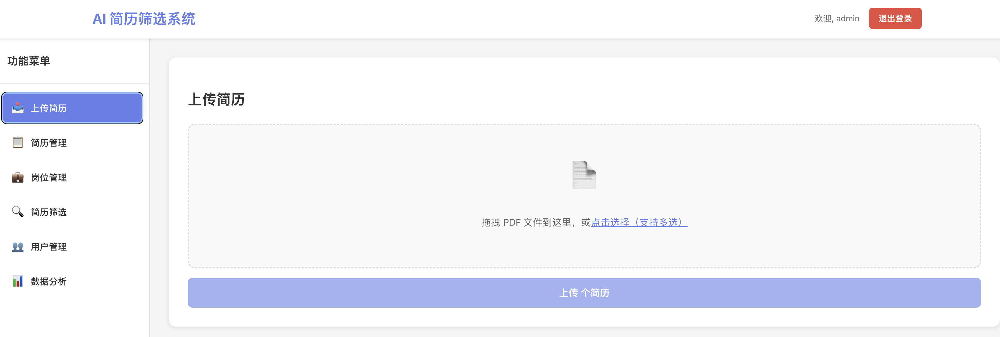
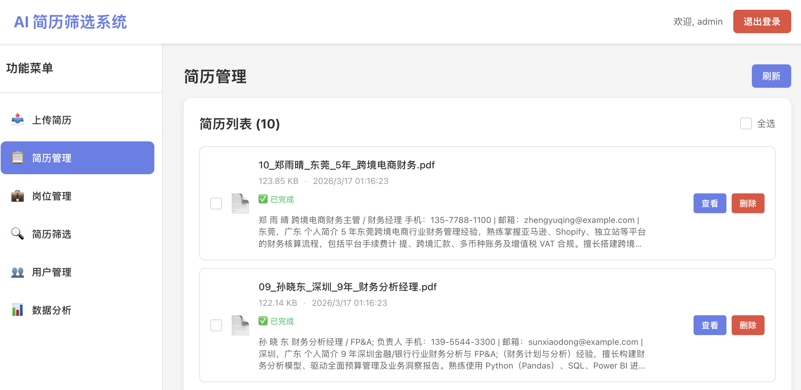
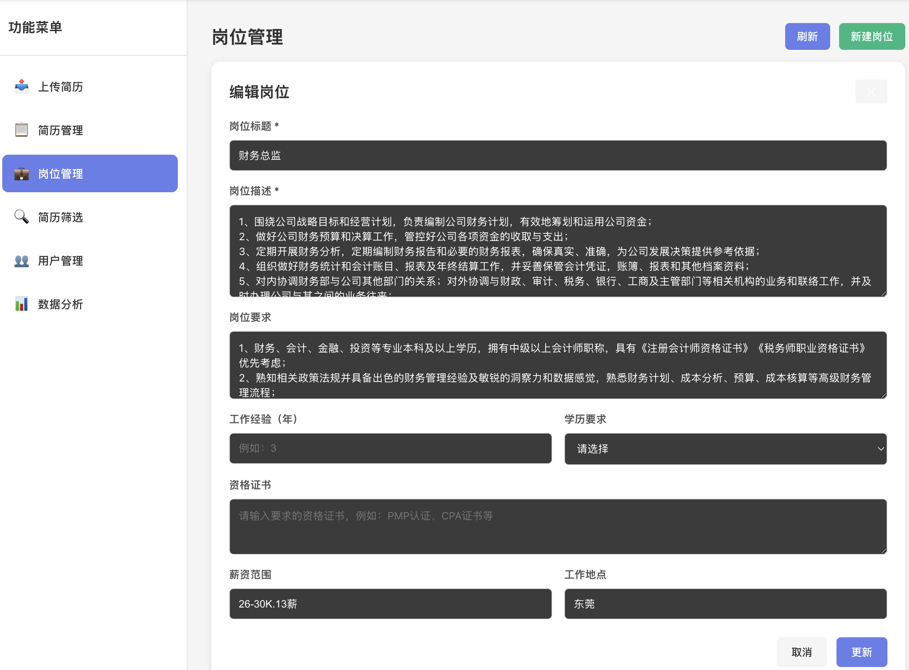
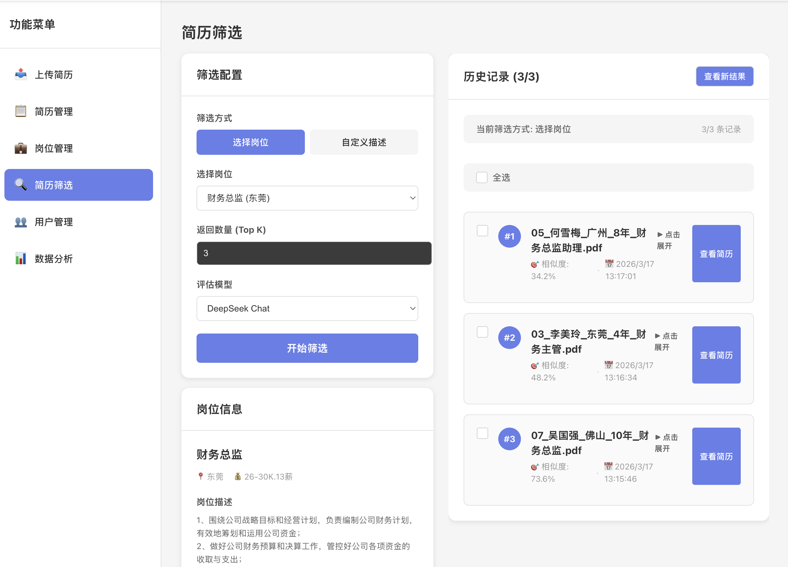
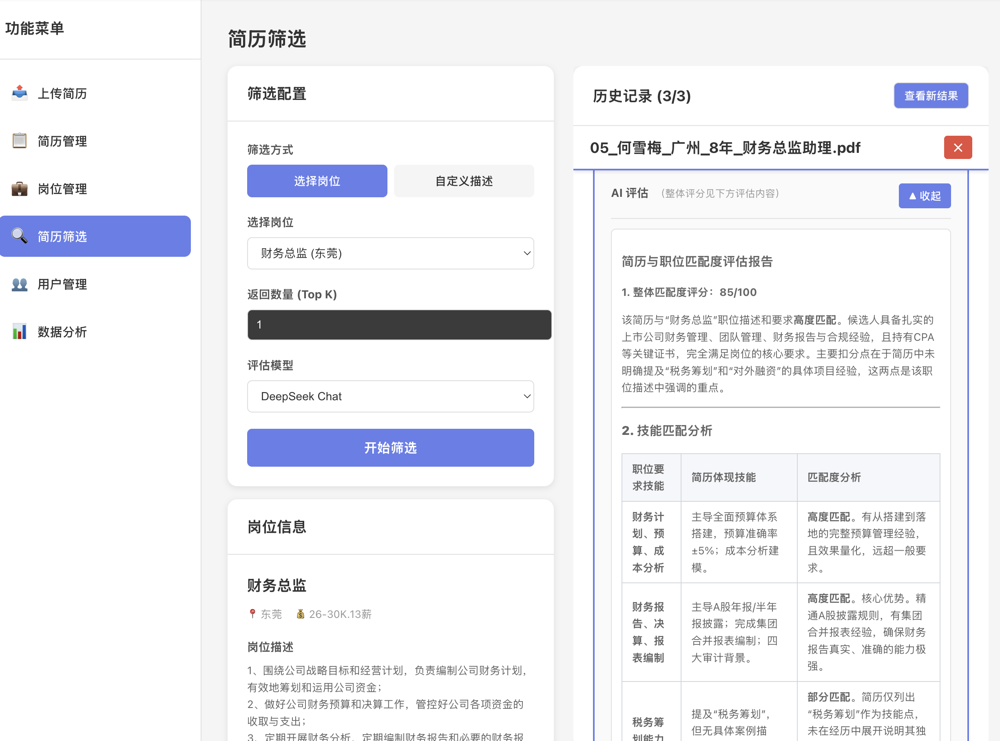
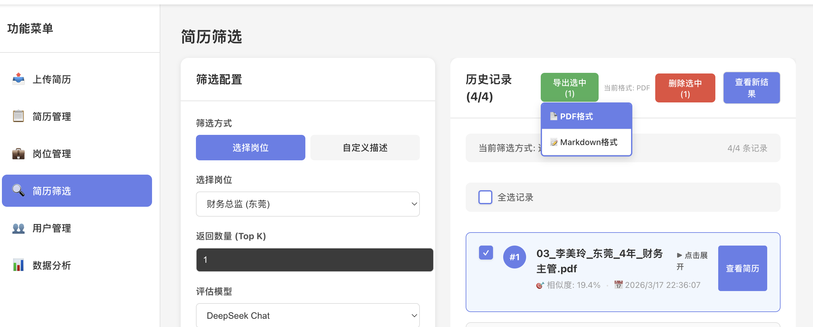
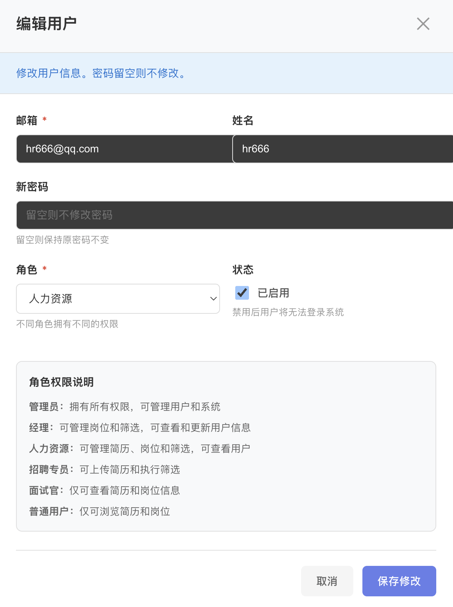

# AI简历筛选系统使用指南

## 🚀 快速开始

### 登录系统
1. 打开系统首页，点击"登录"按钮
2. 输入您的用户名和密码
3. 点击"登录"进入系统

> 💡 **提示**: 如果您是首次使用，请联系管理员创建账号

## 📊 登录后主界面概览

登录后您将看到以下界面布局：

## 📄 简历管理操作指南

### 上传简历
1. 点击左侧菜单"简历管理"
2. 点击"上传简历"按钮
3. 选择简历文件（支持PDF、Word、TXT格式）
4. 系统自动解析简历信息
5. 点击"确认上传"

### 查看简历列表
1. 系统显示所有可见的简历
2. 查看简历基本信息：姓名、联系方式、上传时间等
3. 支持搜索和筛选功能

### 简历详情查看
1. 点击简历列表中的"查看详情"
2. 查看完整的简历内容
3. 可以查看AI解析结果

### 删除简历
1. 在简历列表中找到目标简历
2. 点击"删除"按钮
3. 确认删除操作

> 🔒 **权限说明**:
> - 所有用户都可以上传简历
> - 非管理员只能看到自己上传的简历

## 💼 岗位管理操作指南

### 创建新岗位
1. 点击左侧菜单"岗位管理"
2. 点击"创建岗位"按钮
3. 填写岗位信息：
   - 岗位名称（必填）
   - 岗位描述
   - 任职要求
   - 工作地点
4. 点击"保存"完成创建

### 查看岗位列表
1. 系统显示所有可见的岗位
2. 可以按创建时间、岗位名称排序
3. 支持搜索功能快速定位

### 编辑岗位信息
1. 在岗位列表中找到目标岗位
2. 点击"编辑"按钮
3. 修改岗位信息
4. 点击"保存"确认修改

### 删除岗位
1. 在岗位列表中找到目标岗位
2. 点击"删除"按钮
3. 确认删除操作

> 🔒 **权限说明**:
> - 所有用户都可以创建岗位
> - 非管理员只能看到自己创建的岗位

## 🤖 智能筛选操作指南

### 开始筛选
1. 点击左侧菜单"智能筛选"
2. 选择目标岗位
3. 系统自动分析所有简历的匹配度

### 查看筛选结果
1. 系统显示匹配度排名
2. 查看每个简历的详细匹配分析
3. 可以按匹配度、姓名等排序

### 匹配详情分析
1. 点击简历的"查看详情"
2. 查看AI分析的匹配点：
   - 技能匹配度
   - 经验匹配度
   - 教育背景匹配度
   - 综合评分

### 筛选结果导出
1. 点击"导出结果"按钮
2. 选择导出格式（Markdown/PDF）
3. 下载筛选报告

## 👥 用户管理操作指南

### 查看用户列表
1. 点击左侧菜单"用户管理"
2. 系统显示所有用户列表
3. 查看用户基本信息：用户名、角色、创建时间等

### 添加新用户
1. 点击"添加用户"按钮
2. 填写用户信息：
   - 用户名（必填）
   - 密码（必填）
   - 角色（管理员/HR/普通用户）
3. 点击"保存"完成创建

### 编辑用户信息
1. 在用户列表中找到目标用户
2. 点击"编辑"按钮
3. 修改用户信息
4. 点击"保存"确认修改

### 删除用户
1. 在用户列表中找到目标用户
2. 点击"删除"按钮
3. 确认删除操作

> ⚠️ **权限说明**:
> - **管理员**: 可以管理所有用户
> - **HR**: 只能管理非管理员用户
> - **普通用户**: 无用户管理权限

## 🎯 各角色功能权限对照表

| 功能模块 | 管理员 | HR | 普通用户 |
|---------|--------|----|----------|
| 用户管理 | ✅ 完全权限 | ✅ 仅非管理员 | ❌ 无权限 |
| 岗位管理 | ✅ 所有岗位 | ✅ 所有岗位 | ✅ 仅自己创建 |
| 简历管理 | ✅ 所有简历 | ✅ 所有简历 | ✅ 仅自己上传 |
| 智能筛选 | ✅ 完全权限 | ✅ 完全权限 | ✅ 完全权限 |
| 系统设置 | ✅ 完全权限 | ❌ 无权限 | ❌ 无权限 |

## 💡 实用技巧

### 批量操作
- 支持批量上传简历
- 支持批量删除操作
- 使用多选功能进行批量处理

### 搜索与筛选
- 使用搜索框快速定位
- 利用筛选条件缩小范围
- 保存常用搜索条件

### 数据导出
- 支持导出筛选结果
- 支持导出统计报表
- 多种格式选择（Markdown/PDF）

## 🆘 常见问题解答

### Q: 忘记密码怎么办？
A: 请联系系统管理员重置密码

### Q: 上传简历失败怎么办？
A: 请检查文件格式和大小，确保文件完整

### Q: 筛选结果不准确？
A: 请检查岗位描述是否详细，简历内容是否清晰

### Q: 如何提高筛选准确率？
A: 提供详细的岗位要求，确保简历格式规范

## 📞 技术支持

如遇到技术问题，请联系：
- **系统管理员**: matrix273@qq.com
- **技术支持**: matrix273@qq.com
- **电话**: 400-123-4567

---
*最后更新: 2026年3月 | 版本: v1.0*